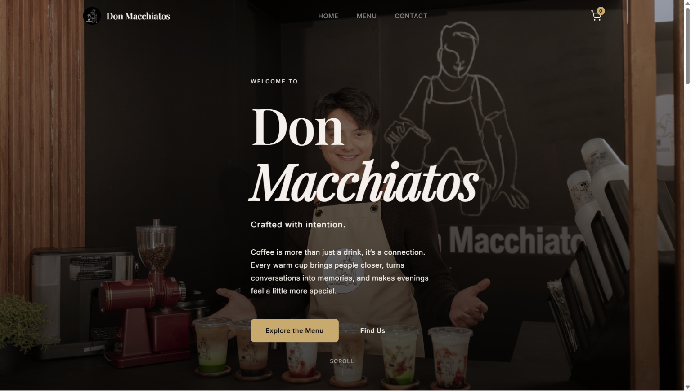
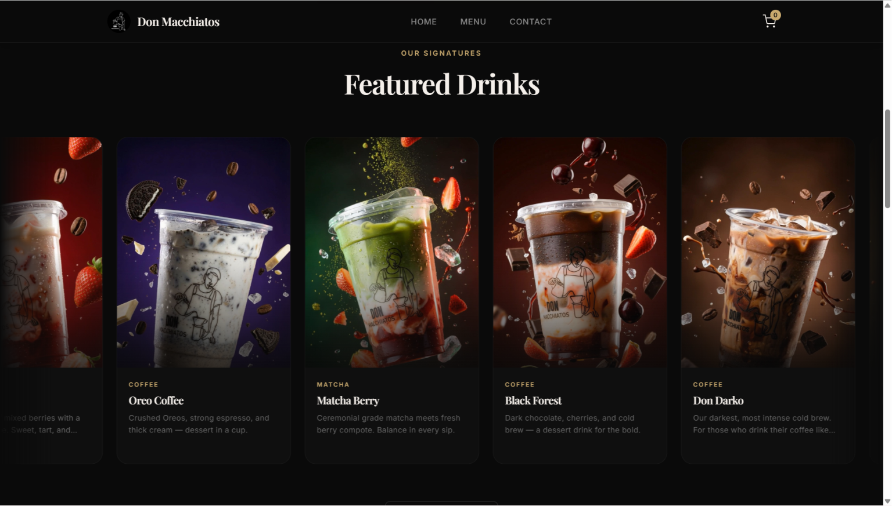
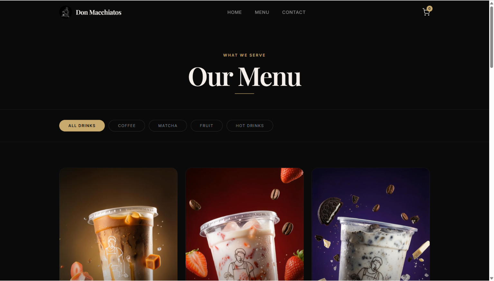
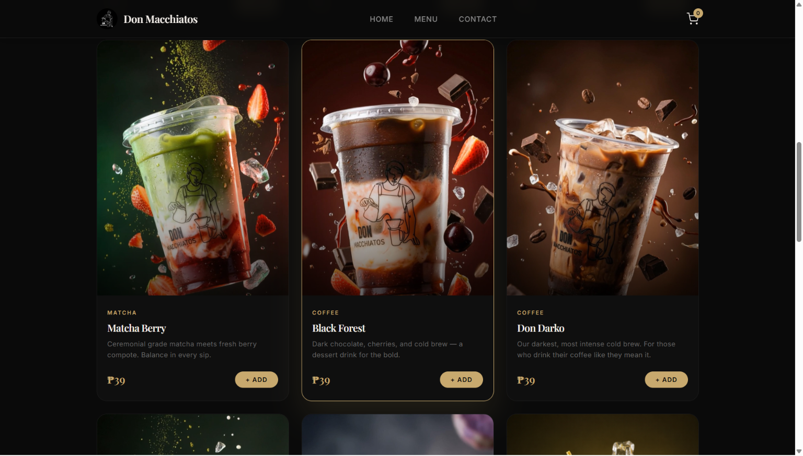
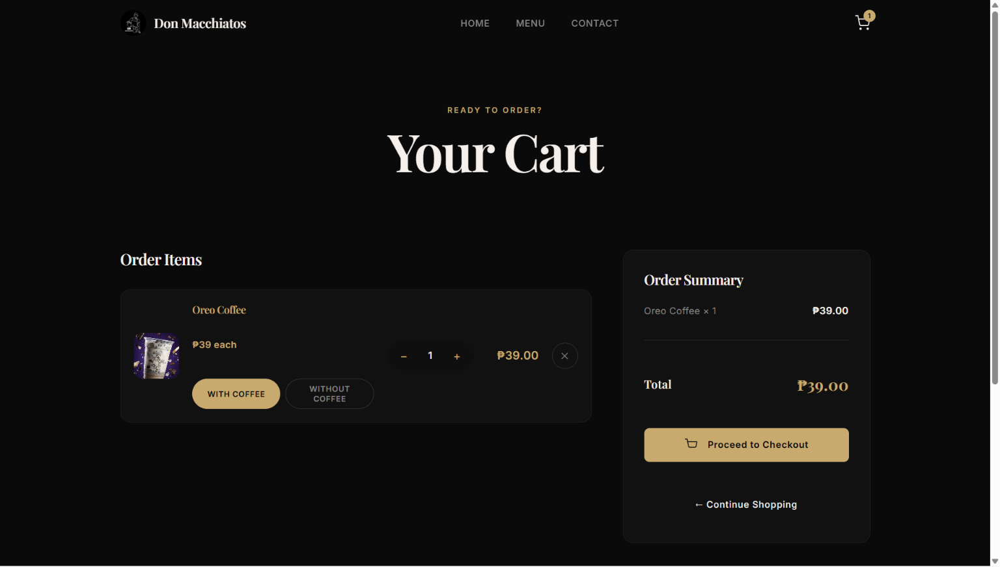
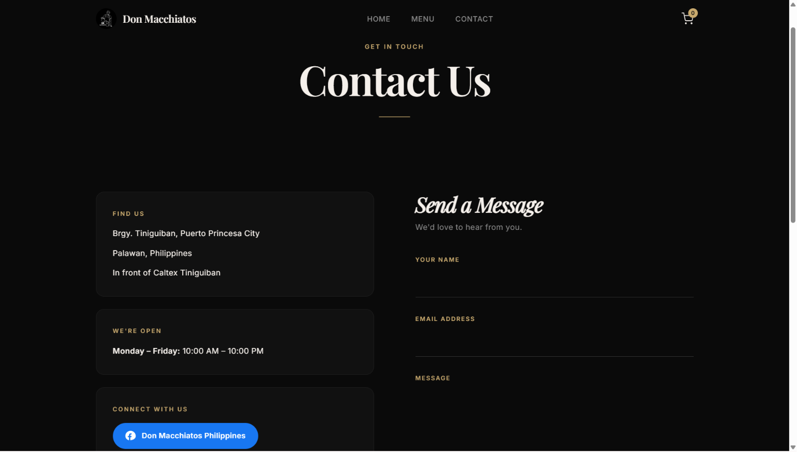

# Don Macchiatos — A premium coffee shop website for ordering drinks online.

## Project Information

| **Subject** | Web Systems and Technologies |
| **Academic Year** | 2025-2026 |
| **Project Category** | Web Development |
| **Instructor** | Divine Caabay |

### Members
* Kimly Mark Bron
* Mark Aaron Figueroa

---

## Project Description

Don Macchiatos is a fully functional coffee shop website built for a real local business based in Brgy. Tiniguiban, Puerto Princesa City, Palawan, Philippines. The website allows customers to browse the full drink menu, add items to a cart, and place pickup or delivery orders online. It was built to give Don Macchiatos a professional online presence and to provide customers with a convenient way to order their favorite drinks without visiting the shop in person. The goal of the project was to apply web development concepts — including backend logic, database management, and frontend design — in a real-world business context.

---

## Features

- Full drink menu with category filters (Coffee, Matcha, Fruit, Hot Drinks)
- Session-based shopping cart with live AJAX updates — no page reload needed
- Checkout form with pickup or delivery option
- Auto-scrolling featured drinks carousel on the home page
- Infinite community photo gallery showcasing real customers
- Scroll animations — fade-in, slide-in, parallax, and stagger effects
- Contact page with shop address, business hours, Facebook link, and message form
- Django Admin panel for managing menu items, orders, and customer messages
- Fully responsive design for mobile, tablet, and desktop
- Order confirmation page after successful checkout

---

## Technologies Used

- Python
- Django
- SQLite
- HTML5
- CSS3
- JavaScript (Vanilla)
- Google Fonts (Playfair Display, Inter)
- Pillow

---

## Installation Guide

**1. Clone the repository**
```bash
git clone [https://github.com/202380269/Don-Mac.git](https://github.com/PSU-CS-Academic-Projects/Don-Macchiatos.git)
```

**2. Navigate into the project folder**
```bash
cd Don-Mac
```

**3. Create and activate a virtual environment**
```bash
# Windows
python -m venv venv
venv\Scripts\activate

# Mac/Linux
python3 -m venv venv
source venv/bin/activate
```

**4. Install dependencies**
```bash
pip install django pillow
```

**5. Apply database migrations**
```bash
python manage.py migrate
```

**6. Create an admin account**
```bash
python manage.py createsuperuser
```

**7. Seed the menu data**
```bash
python manage.py shell
```
Then paste the contents of `seed_menu.py` inside the shell and type `exit()`.

**8. Run the application**
```bash
python manage.py runserver
```

**9. Open in your browser**
```
http://127.0.0.1:8000
```

**10. Upload drink photos via the admin panel**
```
http://127.0.0.1:8000/admin/
```
Go to **Menu Items** → click each drink → upload the correct photo from `static/images/`.

---

## Screenshots

**Home Page**




**Menu Page**




**Cart**



**Contact**




---

## Live Demo

Live URL: *(Not yet deployed)*

---

## Video Demonstration

Video Link: *https://drive.google.com/drive/folders/1YWUndjpmKFblZyjYzsfREkPfewZF5rMx?usp=sharing*

---

## Future Improvements

- User authentication so customers can log in and track their orders
- Online payment integration (GCash, Maya, credit card)
- Real-time order status notifications via SMS or email
- Admin analytics dashboard showing sales per day and best-selling drinks
- Customer reviews and ratings for each drink
- Loyalty points and rewards system for repeat customers
- Mobile app version using Flutter or React Native
- Deployment to a live server for public access
